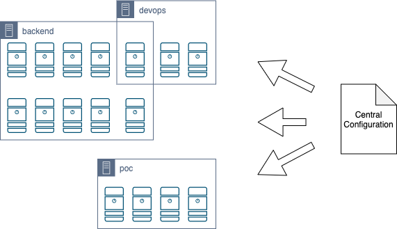

# ssh-manager

[](https://github.com/ReasonSoftware/ssh-manager/releases/latest)
[](https://github.com/ReasonSoftware/ssh-manager/actions)
[](https://goreportcard.com/report/github.com/ReasonSoftware/ssh-manager)
[](LICENSE.md)

:closed_lock_with_key: Central **SSH Management Service** for **AWS Linux EC2** :vertical_traffic_light:



## Features

- Automatically allow/deny SSH access to servers
- Easily manage `sudo` access
- Centrally manage team's SHS Keys
- Only public SSH key is used, private key never leave user's workstation
- Leverage AWS IAM for service authentication
- SystemD Service

## Manual

- Prepare [Central Configuration](#central-configuration) once
- Add new servers by:
    - Complete [Server Configuration](#server-configuration)
    - [Install](#installation) the service

*It is strongly recommended to update the service once in a while*

### Central Configuration

1. Create configuration on **AWS Secret** which will hold a public ssh keys of your team members and server groups with a permissions mapping.

<details><summary>:information_source: AWS Secret Structure</summary>

```json
{
    "users": {
        "user.1": "ssh-rsa AAA...",
        "user.2": "ssh-rsa AAA...",
        "user.3": "ssh-rsa AAA...",
        "user.4": "ssh-rsa AAA...",
        "user.5": "ssh-rsa AAA...",
        "user.6": "ssh-rsa AAA..."
    },
    "server_groups": {
        "backend": {
            "sudoers": [
                "user.2"
            ],
            "users": [
                "user.1",
                "user.4",
                "user.5"
            ]
        },
        "poc": {
            "sudoers": [
                "user.1",
                "user.2",
                "user.4"
            ],
            "users": [
                "user.6"
            ]
        },
        "devops": {
            "sudoers": [
                "user.2"
            ],
            "users": [
                "user.3",
                "user.5"
            ]
        }
    }
}
```

</details>

2. Create IAM Policy to allow servers to fetch the secret.

<details><summary>:information_source: AWS IAM Policy</summary>

```json
{
    "Version": "2012-10-17",
    "Statement": [
        {
            "Effect": "Allow",
            "Action": "secretsmanager:GetSecretValue",
            "Resource": "arn:aws:secretsmanager:*:*:secret:<secret-name>"
        }
    ]
}
```

</details>

### Server Configuration

1. Create a local configuration file `/root/ssh-manager.yml`

```yaml
secret_name: ssh-manager
region: us-west-1
groups:
  - devops
  - poc
```

- `secret_name` (required) - AWS Secret name with a central configuration
- `region` - AWS region where a Secret is stored. Default **us-east-1**
- `groups` (required) - a list of server group names from a central configuration

2. Create and attach an IAM Roles or configure an IAM User to allow EC2's to fetch the secret.
    - If using User Authentication, configure the credentials for root user.

### Installation

- Download installation script: `curl https://raw.githubusercontent.com/ReasonSoftware/ssh-manager/main/scripts/install.sh --output install.sh`
- Execute with elevated privileges: `sudo bash install.sh`

<details><summary>:information_source: Manual Installation</summary>

- Create an application directory: `mkdir -p /var/lib/ssh-manager`
- Download latest [release](https://github.com/ReasonSoftware/ssh-manager/releases/latest) unzip to `/var/lib/ssh-manager`
- Create **systemd** service under `/etc/systemd/system/ssh-manager.service` with the following content:

```
[Unit]
Description=Central SSH Management Service for AWS Linux EC2
Wants=network-online.target
After=network-online.target

[Service]
Type=oneshot
ExecStart=/var/lib/ssh-manager/ssh-manager
StandardOutput=journal
User=root

[Install]
WantedBy=multi-user.target
```

- Create **systemd** timer under `/etc/systemd/system/ssh-manager.timer` with the following content:

```
[Unit]
Description=Timer for Central SSH Management Service
Wants=network-online.target
After=network-online.target

[Timer]
Unit=ssh-manager.service
OnBootSec=10min
OnUnitInactiveSec=60min
Persistent=true

[Install]
WantedBy=multi-user.target
```

- Reload **systemd** configuration: `systemctl daemon-reload`
- Enable **ssh-manager** service: `systemctl enable ssh-manager.service`
- Enable and start **ssh-manager** timer: `systemctl enable --now ssh-manager.timer`

</details>

<details><summary>:information_source: Update</summary>

- Download latest [release](https://github.com/ReasonSoftware/ssh-manager/releases/latest) and replace `/var/lib/ssh-manager/ssh-manager` file

</details>

<details><summary>:information_source: Uninstall</summary>

Decide what are you going to do with the users and either delete them (`userdel -r <username>`) or change their primary group to some other group (`usermod -G <groupname> <username>`)

- Delete systemd service and timer:

```shell
systemctl stop ssh-manager.service
systemctl stop ssh-manager.timer
rm -f /etc/systemd/system/ssh-manager.*
```

- Delete application groups:

```shell
groupdel ssh-manager-users
groupdel ssh-manager-sudoers
```

- Remove `%ssh-manager-sudoers ALL=(ALL) NOPASSWD: ALL` entry from `/etc/sudoers` file
- Delete app directory `rm -rf /var/lib/ssh-manager`
- Delete local configuration file `rm -f /root/ssh-manager.yml`

</details>

## Examples

- [Logs](docs/LOGS.md)

## Notes

- This service strongly relies on Linux capabilities to manage users and group, and will require the following to operate: `sudo`/`useradd`/`userdel`/`usermod`/`bash`
- Users default shell will be set to `bash`
- Assuming sudoers file is `/etc/sudoers`
- Application directory `/var/lib/ssh-manager` will be created automatically
- Custom linux groups `ssh-manager-users`/`ssh-manager-sudoers` will be created with a GID's `32109`/`32108`

## License

[Apache-2.0](LICENSE.md) © 2021 [Reason Cybersecurity Ltd.](https://www.reasonsecurity.com/)
